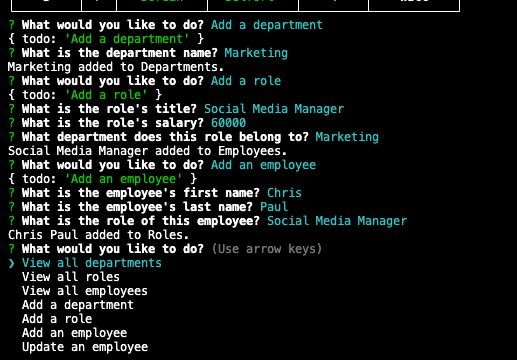

# Employee Tracker

## Table of Contents

1. [Description](#description)
2. [Visuals](#visuals)
3. [Deployment](#deployment)
4. [Video Demo](#video-demo)

## Description

This application uses Node.js. It allows the user to keep track of employee's working for their company using a MySQL database. They can add departments, roles, salaries, and employees.

## Visuals

## Deployment

[> Link to GitHub Repo <](https://github.com/slwooten/employee-tracker)

## Video Demo

[> Link to Video Demonstration <](https://watch.screencastify.com/v/Bz0Xtoy8poqTTYphZHdU)
